# ⚡ Awesome Commodity Trading & Risk Management (CTRM / ETRM)



<p align="center">
  <a href="https://github.com/ishandutta2007/Awesome-Awesome-Awesome"></a>
  <a href="https://discord.gg/jc4xtF58Ve"></a>
  
  
  
  <a href="https://github.com/ishandutta2007"></a>
</p>

> **A curated list of enterprise SaaS CTRM/ETRM platforms, open-source risk engines, quantitative analytics tools, derivative pricing libraries, and physical commodity trading logistics tools.**

*Focused on Commodity & Energy Trading (Oil, Gas, Power, Metals, Agriculture), Physical & Financial Deals, Risk Analytics, Position Management, Hedging & Front-to-Back Office Operations.*

---

## 📌 Table of Contents

- [🌐 SaaS / Hosted Platforms](#-saashosted-platforms)
- [🔓 Open-Source GitHub Projects](#-open-source-github-projects)
- [🛠️ Architecture & Integration Patterns](#️-architecture--integration-patterns)
- [🤝 How to Contribute](#-how-to-contribute)
- [📈 Star History](#-star-history)
- [💖 Support & Community](#-support--community)
- [⚖️ Disclaimer](#️-disclaimer)

---

## 🌐 SaaS/Hosted Platforms

> 📊 **Market Size & Structure**: The global Commodity Trading and Risk Management (CTRM/ETRM) software market size is estimated at **~$2.1 Billion to $3.5 Billion**, expanding at a CAGR of ~5.8%. The market is **moderately fragmented**: dominated by legacy enterprise powerhouses (such as ION Group and FIS Global) alongside specialized cloud-native CTRM vendors catering to mid-market desks and specific commodity verticals (softs, power, gas, and metals).

Below is a curated overview of market-leading SaaS and hosted CTRM/ETRM software platforms sorted by company scale (Revenue / Valuation) descending:

| 🏢 Product / Platform | 📝 Description & Primary Focus | 💰 Company Size (Rev / Valuation) | 🏷️ Starting Pricing | 🎁 Free Tier / Free Trial Limits |
| :--- | :--- | :--- | :--- | :--- |
| **[FIS Integrity / Triple Point Commodity XL](https://www.fisglobal.com/)** | Enterprise CTRM & risk management platform for physical & financial energy, metals, and agricultural commodities. | **~$14.7 Billion Rev / ~$42B Valuation** | `$50,000 / month` (Enterprise tier) | No free tier; 30-day proof-of-concept sandbox for institutional clients |
| **[ION Aspect / Openlink Endur](https://iongroup.com/)** | Flagship enterprise ETRM/CTRM suite for high-volume energy trading desks, derivative risk management, and scheduling. | **~$2.5 Billion Rev / ~$15B Valuation** | `$10,000 / month` (Aspect cloud starting tier) | No free tier; guided interactive sandbox demo available upon request |
| **[Eka Software ETRM](https://www.ekaplus.com/)** | Cloud-native CTRM platform specializing in agricultural, energy, and soft commodity trading lifecycle and logistics. | **~$100 Million Rev / ~$350M Valuation** | `$3,500 / user / month` | 14-day free trial sandbox with pre-loaded market data |
| **[Allegro Horizon](https://www.allegrodev.com/)** | Comprehensive CTRM solution for physical gas, power, and crude oil logistics, deal capture, and exposure management. | **~$80 Million Rev** (Part of ION Energy) | `$15,000 / month` base platform | No free tier; 30-day customized trial environment available |
| **[Brady CTRM](https://www.bradyplc.com/)** | Front-to-back office commodity trading software tailored for metals, energy, and environmental markets. | **~$40 Million Rev** | `$5,000 / month` starting desk tier | 14-day interactive trial environment for trading teams |
| **[CubeLogic](https://www.cubelogic.com/)** | Enterprise risk, credit risk, liquidity, and regulatory reporting suite for energy and commodity trading houses. | **~$30 Million Rev / ~$150M Valuation** | `$4,000 / month` modular suite | No free tier; 14-day guided proof-of-concept environment |
| **[Quor Group](https://www.quor.com/)** | Specialized CTRM solution focused on metals, softs, and physical trade logistics management. | **~$25 Million Rev** | `$3,000 / month` starting module | No free tier; 30-day sandbox trial environment upon request |
| **[Enuit / Entrade](https://www.enuit.com/)** | Multi-commodity ETRM/CTRM platform covering deal entry, risk analysis, physical movement tracking, and accounting. | **~$20 Million Rev** | `$2,500 / month` base desk module | 30-day full-feature trial sandbox for registered trade desks |
| **[Value Creed](https://valuecreed.com/)** | Managed CTRM tech platform and operational risk analytics services for energy commodity trading firms. | **~$15 Million Rev** | `$2,000 / month` managed services tier | No free tier; 14-day trial for operational support tools |
| **[Agiblocks](https://www.agiblocks.com/)** | Modular, cloud-based CTRM software built specifically for agricultural commodity merchants and trade houses. | **~$10 Million Rev** | `$1,500 / month` per trading desk seat | 14-day free trial with full trade capture workflow access |
| **[Previse Coral](https://www.previsecorp.com/)** | Lightweight cloud CTRM oriented around real-time deal capture, risk metrics, and trade valuation. | **~$8 Million Rev** | `$1,200 / month` base risk unit | 30-day free trial sandbox for trade evaluation |

---

## 🔓 Open-Source GitHub Projects

Full-scale CTRM/ETRM platforms require complex regulatory reporting, physical logistics, nominations, credit limits, and multi-commodity trade workflows, making full commercial suites dominant. However, **open-source building blocks** are widely used for quant pricing, Monte Carlo Value-at-Risk (VaR) modeling, and market data analytics.

Below are notable open-source repositories sorted by GitHub Stars_Count descending:

| 📦 Repository & Link | ⭐ GitHub_Stars | 📝 Description & CTRM Application |
| :--- | :---: | :--- |
| **[machine-learning-for-trading](https://github.com/stefan-jansen/machine-learning-for-trading)** | [](https://github.com/stefan-jansen/machine-learning-for-trading/stargazers) | Machine learning code, quantitative strategy backtesting, and market risk models for asset trading. |
| **[QuantLib](https://github.com/lballabio/QuantLib)** | [](https://github.com/lballabio/QuantLib/stargazers) | Premier C++/Python quantitative finance framework for pricing derivatives, yield curves, and risk calculations. |
| **[finmarketpy](https://github.com/cuemacro/finmarketpy)** | [](https://github.com/cuemacro/finmarketpy/stargazers) | Python library for backtesting quantitative trading strategies and analyzing financial market data including commodities. |
| **[ffn](https://github.com/pmorissette/ffn)** | [](https://github.com/pmorissette/ffn/stargazers) | Financial library for Python providing risk metrics, portfolio performance evaluation, and drawdown tracking. |
| **[Open Source Risk Engine (ORE)](https://github.com/OpenSourceRisk/Engine)** | [](https://github.com/OpenSourceRisk/Engine/stargazers) | Enterprise open-source pricing engine, Monte Carlo simulation, XVA, and commodity derivative risk analytics. |
| **[Enerra](https://github.com/Anknoit/Enerra)** | [](https://github.com/Anknoit/Enerra/stargazers) | Experimental Django-based open-source Energy Trade and Risk Management (ETRM) prototype for learning and research. |

---

## 🛠️ Architecture & Integration Patterns

Modern quantitative trading teams combine commercial CTRM platforms with open-source analytical stacks:

```
┌───────────────────────────┐      ┌───────────────────────────┐      ┌───────────────────────────┐
│   Commercial CTRM Suite   │ ───► │  Open Risk Engine (ORE)   │ ───► │   Analytics & BI Dash     │
│ (Deal Entry & Logistics)  │      │ (Monte Carlo & VaR Engine)│      │  (Custom Risk Dashboards) │
└───────────────────────────┘      └───────────────────────────┘      └───────────────────────────┘
```

- **Deal & Trade Capture**: Commercial CTRM (Openlink Endur, Allegro, Enuit, Eka) handles trade entry, counterparty risk, credit limits, and physical settlement logistics.
- **Risk Analytics Layer**: Open-source libraries (**QuantLib**, **ORE**) compute forward curves, Greeks, option pricing, Monte Carlo Value-at-Risk (VaR), and scenario stresses.
- **Reporting & Business Intelligence**: Quantitative desks stream position and P&L data into open BI dashboards and Python notebook pipelines.

---

## 🤝 How to Contribute

Contributions are welcome! Please follow these simple guidelines:

1. Fork this repository.
2. Add your CTRM/ETRM project or open-source tool to `README.md`.
3. Follow the existing tabular structure (include product name, link, pricing/stars, and description).
4. Create a Pull Request with a short summary of the addition.

Check out our curated meta-list at **[Awesome-Awesome-Awesome](https://github.com/ishandutta2007/Awesome-Awesome-Awesome)**!

---

## 📈 Star History

[](https://star-history.dera.page/#ishandutta2007/Awesome-Commodity-Trading-n-Risk-Management&type=date&legend=top-left)

---

## 💖 Support & Community

Thank you for exploring **Awesome Commodity Trading & Risk Management**! If you find this resource helpful for your research, trading desk, or software evaluation:

- ⭐ **Star** this repository on GitHub.
- 🔀 **Fork** it to add your own tools and analytical frameworks.
- 📢 **Share** it with fellow quantitative analysts, energy traders, and risk managers.

<a href="https://github.com/sponsors/ishandutta2007">
  
</a>

---

## ⚖️ Disclaimer

*This list is community-curated for informational and research purposes only. CTRM and ETRM environments manage financial derivatives, energy commodities, and regulatory compliance. Open-source building blocks are not direct replacements for validated enterprise CTRM systems in live production environments. This repository does not constitute financial, risk management, or investment advice.*
